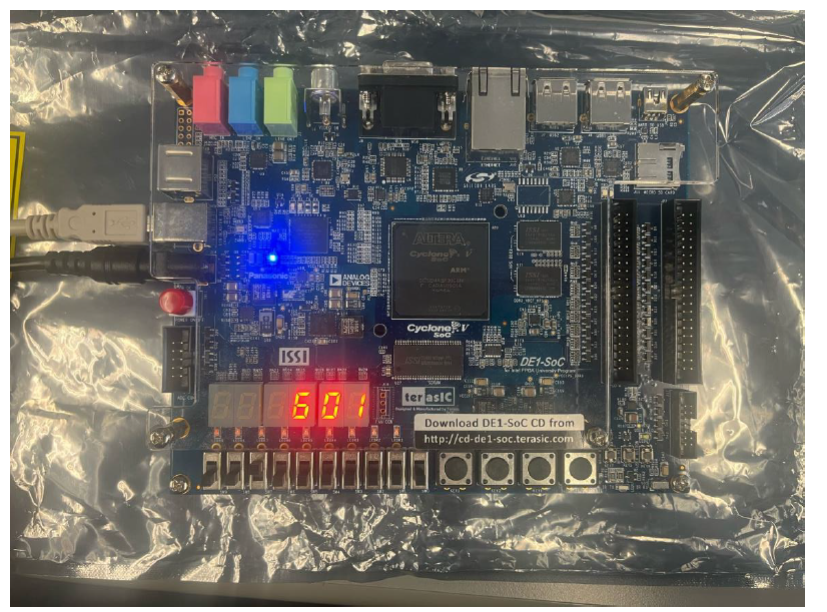

## A Short description of the Circuits Function

## 🧠 Project Overview
This VHDL project implements a hardware-based approximation of the `arccos` function using a polynomial approximation method. The design runs on the DE1-SoC FPGA board, where:
- An **8-bit input** is taken from the board switches,
- The **approximated arccosine angle** is calculated,
- The **result is displayed** in decimal on four 7-segment displays.

## ⚙️ Features
- **Polynomial-based arccos approximation**
- **Binary-to-BCD conversion** for human-readable output
- **Ripple blanking** to suppress leading zeroes on displays
- Timing constraints and analysis included for synthesis on FPGA

